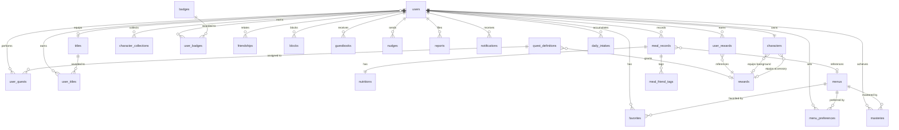

# ERD / DB 스키마

> 상태: 설계 완료

기획 문서([planning.md](planning.md))의 도메인 정의를 기반으로 데이터베이스 스키마를 설계합니다.

---

## 설계 범위

- 메인 DB: PostgreSQL 15+
- 캐시: Redis 7+ (세션, 음식 검색 캐싱)
- 파일 저장: Oracle Object Storage (이미지)

---

## 공통 필드 (BaseDomain)

모든 테이블은 BaseDomain의 필드를 포함하며, ID는 sonyflake로 생성된 64비트 정수(PostgreSQL BIGINT)를 사용합니다.

| 컬럼 | 타입 | 제약 조건 | 설명 |
|------|------|----------|------|
| id | BIGINT | PRIMARY KEY | Sonyflake 기반 고유 ID |
| created_at | TIMESTAMPTZ | NOT NULL | 생성 일시 |
| updated_at | TIMESTAMPTZ | NOT NULL | 수정 일시 |
| deleted_at | TIMESTAMPTZ | - | 삭제 일시 (Soft Delete) |

---

## 도메인별 테이블 상세

### 사용자 (users)

| 컬럼 | 타입 | 제약 조건 | 설명 |
|------|------|----------|------|
| nickname | VARCHAR(50) | UNIQUE, NOT NULL | 서비스 내 닉네임 |
| email | VARCHAR(100) | UNIQUE, NULL | 소셜 이메일 |
| profile_image_url | TEXT | NULL | 프로필 이미지 URL |
| provider | VARCHAR(20) | NOT NULL | kakao, google, apple |
| provider_id | VARCHAR(100) | UNIQUE, NOT NULL | 소셜 서비스 고유 ID |
| last_login_at | TIMESTAMPTZ | - | 마지막 로그인 일시 |
| point | INT | DEFAULT 0 | 보유 재화 (방울) |
| height | FLOAT | NULL | 키 (cm, 소수점 허용) |
| weight | FLOAT | NULL | 몸무게 (kg, 소수점 허용) |
| activity_level | VARCHAR(20) | NULL | LOW, MODERATE, HIGH, VERY_HIGH |
| goal | VARCHAR(20) | NULL | DIET, MAINTAIN, BULK |
| daily_kcal_target | INT | DEFAULT 2000 | 일일 권장 칼로리 목표 |
| daily_carbs_target | INT | DEFAULT 300 | 일일 권장 탄수화물 목표 (g) |
| daily_protein_target | INT | DEFAULT 60 | 일일 권장 단백질 목표 (g) |
| daily_fat_target | INT | DEFAULT 50 | 일일 권장 지방 목표 (g) |
| equipped_title_id | BIGINT | FK (titles.id), NULL | 장착 중인 칭호 |
| privacy_level | VARCHAR(20) | DEFAULT 'PUBLIC' | PUBLIC, FRIENDS, PRIVATE |
| notification_settings | JSONB | DEFAULT '{}' | 알림 유형별 on/off 설정 |

### 캐릭터 (characters)

| 컬럼 | 타입 | 제약 조건 | 설명 |
|------|------|----------|------|
| user_id | BIGINT | FK (users.id), UNIQUE | 소유자 ID (1:1) |
| name | VARCHAR(50) | NOT NULL | 캐릭터 이름 |
| level | INT | DEFAULT 1 | 현재 레벨 |
| exp | INT | DEFAULT 0 | 현재 경험치 |
| evolution_stage | VARCHAR(20) | DEFAULT 'EGG' | EGG, BABY, CHILD, TEEN, ADULT, LEGEND |
| body_type | INT | DEFAULT 3, CHECK (1-5) | 체형 단계 |
| muscle | INT | DEFAULT 3, CHECK (1-5) | 근육 단계 |
| skin_tone | INT | DEFAULT 3, CHECK (1-5) | 피부색 단계 |
| expression | INT | DEFAULT 3, CHECK (1-5) | 표정 단계 |
| penalty_status | VARCHAR(20) | DEFAULT 'NORMAL' | NORMAL, HUNGRY, STARVING, WEAKENED |
| last_recorded_at | TIMESTAMPTZ | NULL | 마지막 식사 기록일 |
| equipped_background_id | BIGINT | FK (rewards.id), NULL | 장착 배경 |
| equipped_accessory_id | BIGINT | FK (rewards.id), NULL | 장착 악세서리 |

### 메뉴 (menus)

| 컬럼 | 타입 | 제약 조건 | 설명 |
|------|------|----------|------|
| name | VARCHAR(100) | NOT NULL | 메뉴명 |
| category | VARCHAR(20) | NOT NULL | KOREAN, CHINESE, JAPANESE, WESTERN, SNACK, CAFE, OTHER |
| default_calories | FLOAT | DEFAULT 0 | 기본 칼로리 (kcal) |
| default_carbs | FLOAT | DEFAULT 0 | 기본 탄수화물 (g) |
| default_protein | FLOAT | DEFAULT 0 | 기본 단백질 (g) |
| default_fat | FLOAT | DEFAULT 0 | 기본 지방 (g) |
| default_fiber | FLOAT | DEFAULT 0 | 기본 식이섬유 (g) |
| default_vitamin_score | FLOAT | DEFAULT 0 | 기본 비타민 달성률 (%) |
| source | VARCHAR(20) | DEFAULT 'USER' | USDA, MFDS, USER |

### 식사 기록 (meal_records)

| 컬럼 | 타입 | 제약 조건 | 설명 |
|------|------|----------|------|
| user_id | BIGINT | FK (users.id), NOT NULL | 작성자 ID |
| menu_id | BIGINT | FK (menus.id), NULL | 메뉴 ID (DB 등록 메뉴인 경우) |
| image_url | TEXT | NULL | 식사 사진 URL |
| menu_name | VARCHAR(100) | NOT NULL | 메뉴 이름 |
| category | VARCHAR(20) | NOT NULL | 음식 카테고리 |
| meal_type | VARCHAR(20) | NOT NULL | BREAKFAST, LUNCH, DINNER, SNACK |
| serving_size | FLOAT | DEFAULT 1.0 | 인분 (0.5, 1.0, 1.5 등) |
| recorded_at | TIMESTAMPTZ | NOT NULL | 실제 식사 시간 |
| weather_tag | VARCHAR(20) | NULL | SUNNY, CLOUDY, RAINY, HOT, COLD |
| mood_tag | VARCHAR(20) | NULL | HAPPY, TIRED, STRESSED, NO_APPETITE, HEARTY |
| review | TEXT | NULL | 한 줄 평 |
| rating | INT | CHECK (1-5), NULL | 별점 |
| is_manual | BOOLEAN | DEFAULT FALSE | 수동 입력 여부 |

### 영양소 (nutritions)

| 컬럼 | 타입 | 제약 조건 | 설명 |
|------|------|----------|------|
| meal_id | BIGINT | FK (meal_records.id), UNIQUE | 해당 식사 ID (1:1) |
| calories | FLOAT | DEFAULT 0 | 칼로리 (kcal) |
| carbs | FLOAT | DEFAULT 0 | 탄수화물 (g) |
| protein | FLOAT | DEFAULT 0 | 단백질 (g) |
| fat | FLOAT | DEFAULT 0 | 지방 (g) |
| sodium | FLOAT | DEFAULT 0 | 나트륨 (mg) |
| fiber | FLOAT | DEFAULT 0 | 식이섬유 (g) |
| vitamin_score | FLOAT | DEFAULT 0 | 비타민 달성률 (%, 식약처 권장 섭취량 대비 주요 비타민 평균 달성률) |

### 일일 섭취 통계 (daily_intakes)

> **날짜 경계**: `date` 필드는 매일 새벽 05:00을 기준으로 구분합니다. 즉, 04:59까지의 기록은 전날 날짜에, 05:00 이후의 기록은 당일 날짜에 귀속됩니다. 퀘스트 초기화(05:00)와 동일한 기준을 적용하여 일관성을 유지합니다.

| 컬럼 | 타입 | 제약 조건 | 설명 |
|------|------|----------|------|
| user_id | BIGINT | FK (users.id), NOT NULL | 사용자 ID |
| date | DATE | NOT NULL | 기록 날짜 (05:00 기준) |
| total_calories | FLOAT | DEFAULT 0 | 일일 총 칼로리 (kcal) |
| total_carbs | FLOAT | DEFAULT 0 | 일일 총 탄수화물 (g) |
| total_protein | FLOAT | DEFAULT 0 | 일일 총 단백질 (g) |
| total_fat | FLOAT | DEFAULT 0 | 일일 총 지방 (g) |
| total_sodium | FLOAT | DEFAULT 0 | 일일 총 나트륨 (mg) |
| total_fiber | FLOAT | DEFAULT 0 | 일일 총 식이섬유 (g) |
| vitamin_score | FLOAT | DEFAULT 0 | 일일 비타민 평균 달성률 (%) |
| meal_count | INT | DEFAULT 0 | 일일 식사 횟수 (비정규화: 캘린더/통계 조회 시 COUNT 쿼리 회피 목적) |

### 즐겨찾기 (favorites)

| 컬럼 | 타입 | 제약 조건 | 설명 |
|------|------|----------|------|
| user_id | BIGINT | FK (users.id), NOT NULL | 사용자 ID |
| menu_id | BIGINT | FK (menus.id), NOT NULL | 메뉴 ID |

### 메뉴 선호도 (menu_preferences)

| 컬럼 | 타입 | 제약 조건 | 설명 |
|------|------|----------|------|
| user_id | BIGINT | FK (users.id), NOT NULL | 사용자 ID |
| menu_id | BIGINT | FK (menus.id), NOT NULL | 메뉴 ID |
| preference | VARCHAR(10) | NOT NULL | LIKE, DISLIKE |

### 먹부림 도감 - 마스터리 (masteries)

| 컬럼 | 타입 | 제약 조건 | 설명 |
|------|------|----------|------|
| user_id | BIGINT | FK (users.id), NOT NULL | 사용자 ID |
| menu_id | BIGINT | FK (menus.id), NOT NULL | 메뉴 ID |
| eat_count | INT | DEFAULT 0 | 누적 섭취 횟수 |
| grade | VARCHAR(20) | DEFAULT 'BEGINNER' | BEGINNER, MANIA, ARTISAN, MASTER |
| first_eaten_at | TIMESTAMPTZ | NOT NULL | 첫 식사일 |
| last_eaten_at | TIMESTAMPTZ | NOT NULL | 최근 식사일 |

### 퀘스트 정의 (quest_definitions)

퀘스트의 템플릿/원형을 정의하는 마스터 테이블입니다. 시스템 기동 시 시드 데이터로 적재됩니다.

| 컬럼 | 타입 | 제약 조건 | 설명 |
|------|------|----------|------|
| quest_type | VARCHAR(50) | UNIQUE, NOT NULL | DAILY_MEAL, WEEKLY_STREAK, ACHIEVEMENT_EVOLUTION 등 |
| period | VARCHAR(10) | NOT NULL | DAILY, WEEKLY, ACHIEVEMENT |
| name | VARCHAR(100) | NOT NULL | 퀘스트명 (예: "오늘의 식사") |
| description | TEXT | NULL | 퀘스트 설명 |
| target_value | INT | NOT NULL | 목표 수치 |
| reward_id | BIGINT | FK (rewards.id), NULL | 완료 시 지급 보상 (일일 퀘스트는 NULL) |

### 사용자 퀘스트 진행 (user_quests)

사용자별 퀘스트 진행 상태를 추적하는 테이블입니다.

| 컬럼 | 타입 | 제약 조건 | 설명 |
|------|------|----------|------|
| user_id | BIGINT | FK (users.id), NOT NULL | 사용자 ID |
| quest_definition_id | BIGINT | FK (quest_definitions.id), NOT NULL | 퀘스트 정의 ID |
| progress | INT | DEFAULT 0 | 현재 진행 수치 |
| status | VARCHAR(20) | DEFAULT 'ONGOING' | ONGOING, COMPLETED, CLAIMED |
| assigned_at | TIMESTAMPTZ | NOT NULL | 퀘스트 할당 일시 |
| completed_at | TIMESTAMPTZ | NULL | 완료 일시 |
| claimed_at | TIMESTAMPTZ | NULL | 보상 수령 일시 |

### 보상 (rewards)

| 컬럼 | 타입 | 제약 조건 | 설명 |
|------|------|----------|------|
| reward_type | VARCHAR(20) | NOT NULL | BACKGROUND, EFFECT, MOTION, ACCESSORY |
| name | VARCHAR(50) | NOT NULL | 보상명 |
| description | TEXT | NULL | 보상 설명 |
| asset_url | TEXT | NULL | 에셋 URL |

### 사용자 보상 (user_rewards)

| 컬럼 | 타입 | 제약 조건 | 설명 |
|------|------|----------|------|
| user_id | BIGINT | FK (users.id), NOT NULL | 사용자 ID |
| reward_id | BIGINT | FK (rewards.id), NOT NULL | 보상 ID |
| quest_id | BIGINT | FK (user_quests.id), NULL | 획득한 퀘스트 |
| achieved_at | TIMESTAMPTZ | NOT NULL | 획득일 |

### 먹찌 도감 (character_collections)

| 컬럼 | 타입 | 제약 조건 | 설명 |
|------|------|----------|------|
| user_id | BIGINT | FK (users.id), NOT NULL | 사용자 ID |
| body_type | INT | NOT NULL | 체형 단계 |
| muscle | INT | NOT NULL | 근육 단계 |
| skin_tone | INT | NOT NULL | 피부색 단계 |
| expression | INT | NOT NULL | 표정 단계 |
| achieved_at | TIMESTAMPTZ | NOT NULL | 달성일 |

### 뱃지 정의 (badges)

| 컬럼 | 타입 | 제약 조건 | 설명 |
|------|------|----------|------|
| code | VARCHAR(50) | UNIQUE, NOT NULL | 뱃지 코드 (FIRST_MEAL, SEVEN_STREAK 등) |
| name | VARCHAR(50) | NOT NULL | 뱃지명 |
| description | TEXT | NULL | 달성 조건 설명 |
| icon_url | TEXT | NULL | 뱃지 아이콘 URL |

### 사용자 뱃지 (user_badges)

| 컬럼 | 타입 | 제약 조건 | 설명 |
|------|------|----------|------|
| user_id | BIGINT | FK (users.id), NOT NULL | 사용자 ID |
| badge_id | BIGINT | FK (badges.id), NOT NULL | 뱃지 ID |
| achieved_at | TIMESTAMPTZ | NOT NULL | 획득일 |

### 칭호 정의 (titles)

| 컬럼 | 타입 | 제약 조건 | 설명 |
|------|------|----------|------|
| code | VARCHAR(50) | UNIQUE, NOT NULL | 칭호 코드 |
| name | VARCHAR(50) | NOT NULL | 칭호명 |
| description | TEXT | NULL | 달성 조건 설명 |

### 사용자 칭호 (user_titles)

| 컬럼 | 타입 | 제약 조건 | 설명 |
|------|------|----------|------|
| user_id | BIGINT | FK (users.id), NOT NULL | 사용자 ID |
| title_id | BIGINT | FK (titles.id), NOT NULL | 칭호 ID |
| achieved_at | TIMESTAMPTZ | NOT NULL | 획득일 |

### 소셜 - 친구 관계 (friendships)

| 컬럼 | 타입 | 제약 조건 | 설명 |
|------|------|----------|------|
| requester_id | BIGINT | FK (users.id), NOT NULL | 요청자 ID |
| receiver_id | BIGINT | FK (users.id), NOT NULL | 수신자 ID |
| status | VARCHAR(20) | DEFAULT 'PENDING' | PENDING, ACCEPTED |

### 소셜 - 차단 (blocks)

차단은 친구 관계와 독립적인 개념이므로 별도 테이블로 관리합니다. 차단 시 기존 친구 관계는 삭제되며, 차단 상태에서는 친구 요청/검색/추천이 양방향으로 제한됩니다.

| 컬럼 | 타입 | 제약 조건 | 설명 |
|------|------|----------|------|
| blocker_id | BIGINT | FK (users.id), NOT NULL | 차단한 사용자 |
| blocked_id | BIGINT | FK (users.id), NOT NULL | 차단당한 사용자 |

### 소셜 - 방명록 (guestbooks)

| 컬럼 | 타입 | 제약 조건 | 설명 |
|------|------|----------|------|
| target_user_id | BIGINT | FK (users.id), NOT NULL | 방명록 주인 ID |
| writer_id | BIGINT | FK (users.id), NOT NULL | 작성자 ID |
| content | TEXT | NOT NULL | 방명록 내용 |
| is_secret | BOOLEAN | DEFAULT FALSE | 비밀글 여부 |

### 소셜 - 응원하기 (nudges)

| 컬럼 | 타입 | 제약 조건 | 설명 |
|------|------|----------|------|
| sender_id | BIGINT | FK (users.id), NOT NULL | 응원 보낸 사람 |
| receiver_id | BIGINT | FK (users.id), NOT NULL | 응원 받은 사람 |

### 소셜 - 신고 (reports)

| 컬럼 | 타입 | 제약 조건 | 설명 |
|------|------|----------|------|
| reporter_id | BIGINT | FK (users.id), NOT NULL | 신고자 |
| target_user_id | BIGINT | FK (users.id), NOT NULL | 신고 대상 |
| reason | VARCHAR(50) | NOT NULL | INAPPROPRIATE_NICKNAME, SPAM, HARASSMENT, OTHER |
| detail | TEXT | NULL | 상세 사유 |
| status | VARCHAR(20) | DEFAULT 'PENDING' | PENDING, REVIEWED, RESOLVED |

### 식사 친구 태그 (meal_friend_tags)

| 컬럼 | 타입 | 제약 조건 | 설명 |
|------|------|----------|------|
| meal_id | BIGINT | FK (meal_records.id), NOT NULL | 식사 기록 ID |
| tagged_user_id | BIGINT | FK (users.id), NOT NULL | 태그된 친구 ID |
| status | VARCHAR(20) | DEFAULT 'PENDING' | PENDING, ACCEPTED |

### 알림 (notifications)

| 컬럼 | 타입 | 제약 조건 | 설명 |
|------|------|----------|------|
| user_id | BIGINT | FK (users.id), NOT NULL | 수신자 ID |
| type | VARCHAR(30) | NOT NULL | NUDGE, QUEST_COMPLETE, FRIEND_REQUEST, PENALTY, GUESTBOOK, LEVEL_UP |
| title | VARCHAR(100) | NOT NULL | 알림 제목 |
| body | TEXT | NULL | 알림 내용 |
| is_read | BOOLEAN | DEFAULT FALSE | 읽음 여부 |
| reference_id | BIGINT | NULL | 관련 리소스 ID (퀘스트 ID, 친구 요청 ID 등) |

---

## ER 다이어그램

---

## 인덱스 전략

### 기본 인덱스

| 테이블 | 인덱스 | 타입 | 용도 |
|--------|--------|------|------|
| users | provider_id | B-tree UNIQUE | 소셜 로그인 조회 |
| users | nickname | B-tree UNIQUE | 닉네임 중복 확인 및 검색 |
| meal_records | (user_id, recorded_at) | B-tree | 캘린더/기간별 조회 |
| meal_records | (user_id, menu_name) | B-tree | 사용자별 메뉴 기록 조회 |
| friendships | (requester_id, receiver_id) | B-tree UNIQUE | 중복 요청 방지 |
| blocks | (blocker_id, blocked_id) | B-tree UNIQUE | 중복 차단 방지 |
| user_quests | (user_id, status) | B-tree | 진행 중 퀘스트 조회 |
| user_quests | (user_id, quest_definition_id, assigned_at) | B-tree | 사용자별 퀘스트 이력 조회 |
| quest_definitions | quest_type | B-tree UNIQUE | 퀘스트 타입별 조회 |
| nutritions | meal_id | B-tree UNIQUE | 식사별 영양소 조인 |
| daily_intakes | (user_id, date) | B-tree UNIQUE | 사용자별 일일 통계 조회 |

### 고유 제약 인덱스

| 테이블 | 인덱스 | 용도 |
|--------|--------|------|
| menus | (name, category) | 동일 카테고리 내 메뉴명 중복 방지 |
| favorites | (user_id, menu_id) | 중복 즐겨찾기 방지 |
| menu_preferences | (user_id, menu_id) | 중복 선호 설정 방지 |
| masteries | (user_id, menu_id) | 사용자별 메뉴 마스터리 유일성 |
| character_collections | (user_id, body_type, muscle, skin_tone, expression) | 중복 도감 방지 |
| user_badges | (user_id, badge_id) | 중복 뱃지 방지 |
| user_titles | (user_id, title_id) | 중복 칭호 방지 |
| user_rewards | (user_id, reward_id) | 중복 보상 방지 |
| meal_friend_tags | (meal_id, tagged_user_id) | 중복 태그 방지 |

### 조회 최적화 인덱스

| 테이블 | 인덱스 | 타입 | 용도 |
|--------|--------|------|------|
| menus | name | GIN (pg_trgm) | 메뉴명 부분 검색 |
| menus | category | B-tree | 카테고리별 필터 |
| notifications | (user_id, is_read, created_at) | B-tree | 읽지 않은 알림 조회 |
| nudges | (sender_id, receiver_id, created_at) | B-tree | 일일 응원 횟수 제한 체크 |
| reports | (target_user_id, status) | B-tree | 신고 현황 조회 |
| guestbooks | (target_user_id, created_at) | B-tree | 방명록 최신순 조회 |

---

## 마이그레이션 도구

- GORM AutoMigrate (개발 환경)
- Bytebase (프로덕션 마이그레이션 관리)

---

## PostgreSQL 확장

- `pg_trgm`: 메뉴명 부분 문자열 검색 최적화 (GIN 인덱스)
