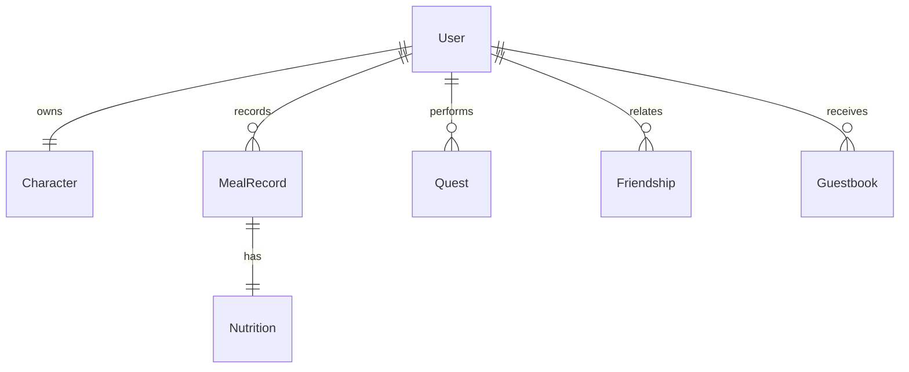

# ERD / DB 스키마

> 상태: 설계 예정

기획 문서([planning.md](planning.md))의 도메인 정의를 기반으로 데이터베이스 스키마를 설계합니다.

---

## 설계 범위

- 메인 DB: PostgreSQL 15+
- 캐시: Redis 7+ (세션, 음식 검색 캐싱)
- 파일 저장: Oracle Object Storage (이미지)

---

## 공통 필드 (BaseDomain)

모든 테이블은 BaseDomain의 필드를 포함하며, ID는 sonyflake로 생성된 64비트 정수(PostgreSQL BIGINT)를 사용합니다.

| 컬럼 | 타입 | 제약 조건 | 설명 |
|------|------|----------|------|
| id | BIGINT | PRIMARY KEY | Sonyflake 기반 고유 ID |
| created_at | TIMESTAMPTZ | NOT NULL | 생성 일시 |
| updated_at | TIMESTAMPTZ | NOT NULL | 수정 일시 |
| deleted_at | TIMESTAMPTZ | - | 삭제 일시 (Soft Delete) |
| is_active | BOOLEAN | DEFAULT TRUE, NOT NULL | 활성화 여부 |

---

## 도메인별 테이블 상세

### 사용자 (User)

| 컬럼 | 타입 | 제약 조건 | 설명 |
|------|------|----------|------|
| nickname | VARCHAR(50) | UNIQUE, NOT NULL | 서비스 내 닉네임 |
| email | VARCHAR(100) | UNIQUE, NULL | 소셜 이메일 |
| profile_image_url | TEXT | NULL | 프로필 이미지 URL |
| provider | VARCHAR(20) | NOT NULL | kakao, google, apple |
| provider_id | VARCHAR(100) | UNIQUE, NOT NULL | 소셜 서비스 고유 ID |
| last_login_at | TIMESTAMPTZ | - | 마지막 로그인 일시 |
| point | INT | DEFAULT 0 | 보유 재화 (방울) |
| daily_kcal_target | INT | DEFAULT 2000 | 일일 권장 칼로리 목표 |
| daily_carbs_target | INT | DEFAULT 300 | 일일 권장 탄수화물 목표 (g) |
| daily_protein_target | INT | DEFAULT 60 | 일일 권장 단백질 목표 (g) |
| daily_fat_target | INT | DEFAULT 50 | 일일 권장 지방 목표 (g) |
| privacy_level | VARCHAR(20) | DEFAULT 'PUBLIC' | PUBLIC, FRIENDS, PRIVATE |

### 캐릭터 (Character)

| 컬럼 | 타입 | 제약 조건 | 설명 |
|------|------|----------|------|
| user_id | BIGINT | FK (users.id) | 소유자 ID |
| name | VARCHAR(50) | NOT NULL | 캐릭터 이름 |
| level | INT | DEFAULT 1 | 현재 레벨 |
| exp | INT | DEFAULT 0 | 현재 경험치 |
| status_image_url | TEXT | NULL | 캐릭터 외형 이미지 |

### 식사 기록 (MealRecord)

| 컬럼 | 타입 | 제약 조건 | 설명 |
|------|------|----------|------|
| user_id | BIGINT | FK (users.id) | 작성자 ID |
| image_url | TEXT | NOT NULL | 식사 사진 URL |
| category | VARCHAR(20) | NOT NULL | 음식 카테고리 (한식, 중식 등) |
| menu_name | VARCHAR(100) | NOT NULL | 메뉴 이름 |
| recorded_at | TIMESTAMPTZ | NOT NULL | 실제 식사 시간 |
| review | TEXT | NULL | 한 줄 평 |
| rating | INT | CHECK (1-5) | 별점 |
| is_manual | BOOLEAN | DEFAULT FALSE | 수동 입력 여부 (AI 분석 실패 등) |

### 영양소 (Nutrition)

| 컬럼 | 타입 | 제약 조건 | 설명 |
|------|------|----------|------|
| meal_id | BIGINT | FK (meal_records.id) | 해당 식사 ID |
| calories | FLOAT | DEFAULT 0 | 칼로리 (kcal) |
| carbs | FLOAT | DEFAULT 0 | 탄수화물 (g) |
| protein | FLOAT | DEFAULT 0 | 단백질 (g) |
| fat | FLOAT | DEFAULT 0 | 지방 (g) |
| sodium | FLOAT | DEFAULT 0 | 나트륨 (mg) |

### 퀘스트 (Quest)

| 컬럼 | 타입 | 제약 조건 | 설명 |
|------|------|----------|------|
| user_id | BIGINT | FK (users.id) | 사용자 ID |
| quest_type | VARCHAR(50) | NOT NULL | DAILY_MEAL, INVITE_FRIEND 등 |
| progress | INT | DEFAULT 0 | 현재 진행 수치 |
| target_value | INT | NOT NULL | 목표 수치 |
| status | VARCHAR(20) | DEFAULT 'ONGOING' | ONGOING, COMPLETED, CLAIMED |

### 소셜 (Friend / Guestbook)

#### friendships
| 컬럼 | 타입 | 제약 조건 | 설명 |
|------|------|----------|------|
| requester_id | BIGINT | FK (users.id) | 요청자 ID |
| receiver_id | BIGINT | FK (users.id) | 수신자 ID |
| status | VARCHAR(20) | DEFAULT 'PENDING' | PENDING, ACCEPTED, BLOCKED |

#### guestbooks
| 컬럼 | 타입 | 제약 조건 | 설명 |
|------|------|----------|------|
| target_user_id | BIGINT | FK (users.id) | 방명록 주인 ID |
| writer_id | BIGINT | FK (users.id) | 작성자 ID |
| content | TEXT | NOT NULL | 방명록 내용 |
| is_secret | BOOLEAN | DEFAULT FALSE | 비밀글 여부 |

---

## ER 다이어그램

---

## 인덱스 전략 (예정)

- users.provider_id : 소셜 로그인 조회 최적화
- meal_records.user_id, recorded_at : 사용자별 식사 캘린더 및 기간별 조회(주간/월간) 최적화
- friendships.requester_id, receiver_id : 친구 관계 조회 최적화

---

## 마이그레이션 도구

- GORM AutoMigrate (개발 환경)
- Bytebase (프로덕션 마이그레이션 관리)
