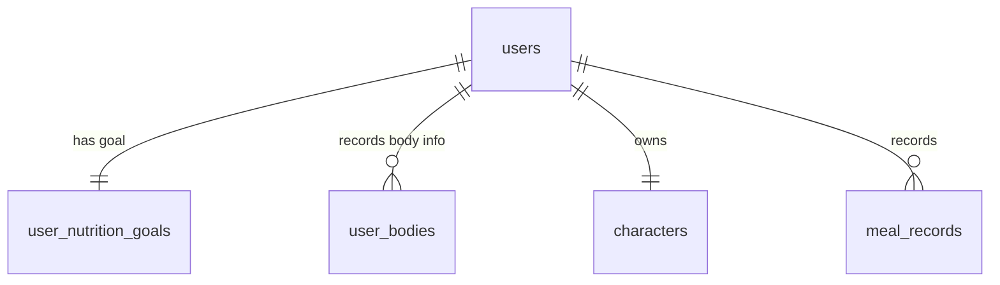

# ERD / DB 스키마

> 상태: 진행 중 (User 분리 리팩토링 반영 완료)

기획 문서([planning.md](planning.md))의 도메인 정의를 기반으로 데이터베이스 스키마를 설계합니다.

---

## 공통 필드 (BaseDomain)

모든 테이블은 BaseDomain의 필드를 포함하며, ID는 sonyflake로 생성된 64비트 정수(PostgreSQL BIGINT)를 사용합니다.

| 컬럼 | 타입 | 제약 조건 | 설명 |
|------|------|----------|------|
| id | BIGINT | PRIMARY KEY | Sonyflake 기반 고유 ID |
| created_at | TIMESTAMPTZ | NOT NULL | 생성 일시 |
| updated_at | TIMESTAMPTZ | NOT NULL | 수정 일시 |
| deleted_at | TIMESTAMPTZ | - | 삭제 일시 (Soft Delete) |

---

## 도메인별 테이블 상세

### 사용자 (users)

사용자의 계정 및 기본 프로필 정보를 관리합니다.

| 컬럼 | 타입 | 제약 조건 | 설명 |
|------|------|----------|------|
| username | VARCHAR(50) | UNIQUE, NOT NULL | 로그인용 아이디 |
| password | VARCHAR(255) | NOT NULL | 해싱된 비밀번호 |
| email | VARCHAR(100) | UNIQUE, NOT NULL | 이메일 주소 |
| nickname | VARCHAR(50) | UNIQUE, NOT NULL | 서비스 내 닉네임 |
| profile_image_url | TEXT | NULL | 프로필 이미지 URL |
| last_login_at | TIMESTAMPTZ | - | 마지막 로그인 일시 |
| point | INT | DEFAULT 0 | 보유 재화 (방울) |
| provider | VARCHAR(20) | NULL | OAuth 제공자 (kakao, google, apple) |
| provider_id | VARCHAR(100) | UNIQUE, NULL | 소셜 서비스 고유 ID |
| equipped_title_id | BIGINT | FK (titles.id), NULL | 장착 중인 칭호 |
| privacy_level | VARCHAR(20) | DEFAULT 'PUBLIC' | PUBLIC, FRIENDS, PRIVATE |
| notification_settings | JSONB | DEFAULT '{}' | 알림 유형별 on/off 설정 |

### 사용자 신체 정보 (user_bodies)

사용자의 신체 변화 이력을 관리합니다. (1:N 이력 구조)

| 컬럼 | 타입 | 제약 조건 | 설명 |
|------|------|----------|------|
| user_id | BIGINT | FK (users.id), NOT NULL | 소유자 ID |
| height | FLOAT | NOT NULL | 키 (cm) |
| weight | FLOAT | NOT NULL | 몸무게 (kg) |
| activity_level | VARCHAR(20) | NOT NULL | LOW, MODERATE, HIGH, VERY_HIGH |

### 사용자 영양 목표 (user_nutrition_goals)

사용자의 다이어트 목표와 그에 따른 계산된 목표 수치를 관리합니다. (1:1 구조)

| 컬럼 | 타입 | 제약 조건 | 설명 |
|------|------|----------|------|
| user_id | BIGINT | FK (users.id), UNIQUE, NOT NULL | 소유자 ID |
| goal | VARCHAR(20) | NOT NULL | DIET, MAINTAIN, BULK |
| daily_kcal_target | INT | DEFAULT 2000 | 일일 칼로리 목표 |
| daily_carbs_target | INT | DEFAULT 300 | 일일 탄수화물 목표 (g) |
| daily_protein_target | INT | DEFAULT 60 | 일일 단백질 목표 (g) |
| daily_fat_target | INT | DEFAULT 50 | 일일 지방 목표 (g) |

### 사용자 기기 (user_devices)

FCM 푸시 알림 발송을 위한 기기 토큰을 관리합니다. 한 사용자가 여러 기기를 사용할 수 있습니다.

| 컬럼 | 타입 | 제약 조건 | 설명 |
|------|------|----------|------|
| user_id | BIGINT | FK (users.id), NOT NULL | 소유자 ID |
| fcm_token | TEXT | NOT NULL | FCM 기기 토큰 |
| device_type | VARCHAR(10) | NOT NULL | IOS, ANDROID, WEB |
| last_used_at | TIMESTAMPTZ | NOT NULL | 마지막 사용 일시 |

### 친구 관계 (friendships)

| 컬럼 | 타입 | 제약 조건 | 설명 |
|------|------|----------|------|
| requester_id | BIGINT | FK (users.id), NOT NULL | 요청자 ID |
| receiver_id | BIGINT | FK (users.id), NOT NULL | 수신자 ID |
| status | VARCHAR(20) | DEFAULT 'PENDING' | PENDING, ACCEPTED |

### 차단 (blocks)

| 컬럼 | 타입 | 제약 조건 | 설명 |
|------|------|----------|------|
| blocker_id | BIGINT | FK (users.id), NOT NULL | 차단한 사용자 |
| blocked_id | BIGINT | FK (users.id), NOT NULL | 차단당한 사용자 |

### 방명록 (guestbooks)

삭제 권한: 작성자(`writer_id`) 또는 방명록 주인(`target_user_id`) 모두 삭제 가능.

| 컬럼 | 타입 | 제약 조건 | 설명 |
|------|------|----------|------|
| target_user_id | BIGINT | FK (users.id), NOT NULL | 방명록 주인 ID |
| writer_id | BIGINT | FK (users.id), NOT NULL | 작성자 ID |
| content | TEXT | NOT NULL | 방명록 내용 |
| is_secret | BOOLEAN | DEFAULT FALSE | 비밀글 여부 |

### 응원 (nudges)

| 컬럼 | 타입 | 제약 조건 | 설명 |
|------|------|----------|------|
| sender_id | BIGINT | FK (users.id), NOT NULL | 응원 보낸 사용자 |
| receiver_id | BIGINT | FK (users.id), NOT NULL | 응원 받은 사용자 |

### 신고 (reports)

| 컬럼 | 타입 | 제약 조건 | 설명 |
|------|------|----------|------|
| reporter_id | BIGINT | FK (users.id), NOT NULL | 신고자 |
| target_user_id | BIGINT | FK (users.id), NOT NULL | 신고 대상 |
| reason | VARCHAR(50) | NOT NULL | 신고 사유 |
| detail | TEXT | NULL | 상세 사유 |
| status | VARCHAR(20) | DEFAULT 'PENDING' | 처리 상태 |

### 알림 (notifications)

| 컬럼 | 타입 | 제약 조건 | 설명 |
|------|------|----------|------|
| user_id | BIGINT | FK (users.id), NOT NULL | 수신자 |
| sender_id | BIGINT | FK (users.id), NULL | 발신자 (시스템 알림인 경우 NULL) |
| type | VARCHAR(50) | NOT NULL | 알림 유형 (FRIEND_REQUEST 등) |
| title | VARCHAR(100) | NOT NULL | 알림 제목 |
| content | TEXT | NOT NULL | 알림 본문 |
| link_url | TEXT | NULL | 클릭 시 이동할 URL |
| is_read | BOOLEAN | DEFAULT FALSE | 읽음 여부 |
| read_at | TIMESTAMPTZ | NULL | 읽은 일시 |
| metadata | JSONB | NULL | 추가 데이터 (이벤트 관련 ID 등) |

---

## ER 다이어그램

```mermaid
erDiagram
    users ||--|| user_nutrition_goals : "has goal"
    users ||--o{ user_bodies : "records body info"
    users ||--|| characters : owns
    users ||--o{ meal_records : records
    
    %% ... (이전과 동일한 나머지 관계들)
```

---

## 인덱스 전략

| 테이블 | 인덱스 | 타입 | 용도 |
|--------|--------|------|------|
| user_bodies | user_id | B-tree | 사용자별 신체 이력 조회 및 최신값 필터링 |
| user_nutrition_goals | user_id | B-tree UNIQUE | 사용자별 단일 목표 조회 최적화 |
