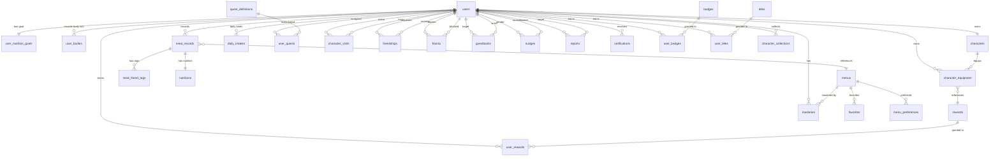

# ERD / DB 스키마

> 상태: 구현 완료 (GORM AutoMigrate 기반, 도메인 엔티티와 동기화)

기획 문서([planning.md](planning.md))의 도메인 정의를 기반으로 데이터베이스 스키마를 설계합니다.

---

## 공통 필드 (BaseDomain)

모든 테이블은 BaseDomain의 필드를 포함하며, ID는 sonyflake로 생성된 64비트 정수(PostgreSQL BIGINT)를 사용합니다.

| 컬럼 | 타입 | 제약 조건 | 설명 |
|------|------|----------|------|
| id | BIGINT | PRIMARY KEY | Sonyflake 기반 고유 ID |
| created_at | TIMESTAMPTZ | NOT NULL | 생성 일시 |
| updated_at | TIMESTAMPTZ | NOT NULL | 수정 일시 |
| deleted_at | TIMESTAMPTZ | - | 삭제 일시 (Soft Delete) |

---

## 도메인별 테이블 상세

### 사용자 (users)

사용자의 계정 및 기본 프로필 정보를 관리합니다.

| 컬럼 | 타입 | 제약 조건 | 설명 |
|------|------|----------|------|
| username | VARCHAR(50) | UNIQUE, NOT NULL | 로그인용 아이디 |
| password | VARCHAR(255) | NOT NULL | 해싱된 비밀번호 |
| email | VARCHAR(100) | UNIQUE, NOT NULL | 이메일 주소 |
| nickname | VARCHAR(50) | UNIQUE, NOT NULL | 서비스 내 닉네임 |
| profile_image_url | TEXT | NULL | 프로필 이미지 URL |
| last_login_at | TIMESTAMPTZ | - | 마지막 로그인 일시 |
| point | INT | DEFAULT 0 | 보유 재화 (방울) |
| allergies | TEXT | DEFAULT '' | 알레르기 정보 (메뉴 추천 필터링용) |
| provider | VARCHAR(20) | NULL | OAuth 제공자 필드 (소셜 로그인 미구현, 스키마만 존재) |
| provider_id | VARCHAR(100) | UNIQUE, NULL | 소셜 서비스 고유 ID (미사용) |
| equipped_title_id | BIGINT | FK (titles.id), NULL | 장착 중인 칭호 |
| privacy_level | VARCHAR(20) | DEFAULT 'PUBLIC' | PUBLIC, FRIENDS, PRIVATE |
| notification_settings | JSONB | DEFAULT '{}' | 알림 유형별 on/off 설정 |

### 캐릭터 (characters)

사용자당 1개. 당일 영양소 기반 파츠 외형 및 패널티 상태를 관리합니다.

| 컬럼 | 타입 | 제약 조건 | 설명 |
|------|------|----------|------|
| user_id | BIGINT | FK (users.id), UNIQUE, NOT NULL | 소유자 ID |
| name | VARCHAR(20) | NOT NULL | 먹찌 이름 |
| body_type | SMALLINT | NOT NULL DEFAULT 3 | 체형 파츠 단계 (0~4) |
| muscle | SMALLINT | NOT NULL DEFAULT 3 | 근육 파츠 단계 (0~4) |
| skin_tone | SMALLINT | NOT NULL DEFAULT 3 | 피부색 파츠 단계 (0~4) |
| expression | SMALLINT | NOT NULL DEFAULT 3 | 표정 파츠 단계 (0~4) |
| penalty_status | VARCHAR(20) | NOT NULL DEFAULT 'NORMAL' | NORMAL, HUNGRY, STARVING, WEAKENED |
| level | INT | DEFAULT 1 | 캐릭터 레벨 |
| exp | INT | DEFAULT 0 | 경험치 |
| streak_days | INT | NOT NULL DEFAULT 0 | 연속 기록일 |
| nutrition_achievement_days | INT | NOT NULL DEFAULT 0 | 영양 밸런스 달성일 누적 수 |
| last_recorded_at | TIMESTAMPTZ | NULL | 마지막 식사 기록 일시 |
| equipped_background_id | BIGINT | FK (rewards.id), NULL | (Deprecated) 장착 중인 배경 보상 |
| equipped_accessory_id | BIGINT | FK (rewards.id), NULL | (Deprecated) 장착 중인 악세서리 보상 |

### 사용자 신체 정보 (user_bodies)

사용자의 신체 변화 이력을 관리합니다. (1:N 이력 구조)

| 컬럼 | 타입 | 제약 조건 | 설명 |
|------|------|----------|------|
| user_id | BIGINT | FK (users.id), NOT NULL | 소유자 ID |
| height | FLOAT | NOT NULL | 키 (cm) |
| weight | FLOAT | NOT NULL | 몸무게 (kg) |
| activity_level | VARCHAR(20) | NOT NULL | LOW, MODERATE, HIGH, VERY_HIGH |

### 사용자 영양 목표 (user_nutrition_goals)

사용자의 다이어트 목표와 그에 따른 계산된 목표 수치를 관리합니다. (1:1 구조)

| 컬럼 | 타입 | 제약 조건 | 설명 |
|------|------|----------|------|
| user_id | BIGINT | FK (users.id), UNIQUE, NOT NULL | 소유자 ID |
| goal | VARCHAR(20) | NOT NULL | DIET, MAINTAIN, BULK |
| daily_kcal_target | INT | - | 일일 칼로리 목표 (온보딩 시 TDEE 기반 계산) |
| daily_carbs_target | INT | - | 일일 탄수화물 목표 g (kcal×0.5÷4) |
| daily_protein_target | INT | - | 일일 단백질 목표 g (kcal×0.3÷4) |
| daily_fat_target | INT | - | 일일 지방 목표 g (kcal×0.2÷9) |

> 목표 수치는 DB 기본값이 아니라 온보딩/목표 변경 시 신체 정보(키·몸무게·활동량) 기반 TDEE에서 계산됩니다.

### 친구 관계 (friendships)

| 컬럼 | 타입 | 제약 조건 | 설명 |
|------|------|----------|------|
| requester_id | BIGINT | FK (users.id), NOT NULL | 요청자 ID |
| receiver_id | BIGINT | FK (users.id), NOT NULL | 수신자 ID |
| status | VARCHAR(20) | DEFAULT 'PENDING' | PENDING, ACCEPTED |
| friendship_score | INT | DEFAULT 0 | 친밀도 점수 (상호작용 누적) |

### 차단 (blocks)

| 컬럼 | 타입 | 제약 조건 | 설명 |
|------|------|----------|------|
| blocker_id | BIGINT | FK (users.id), NOT NULL | 차단한 사용자 |
| blocked_id | BIGINT | FK (users.id), NOT NULL | 차단당한 사용자 |

### 방명록 (guestbooks)

삭제 권한: 작성자(`writer_id`) 또는 방명록 주인(`target_user_id`) 모두 삭제 가능.

| 컬럼 | 타입 | 제약 조건 | 설명 |
|------|------|----------|------|
| target_user_id | BIGINT | FK (users.id), NOT NULL | 방명록 주인 ID |
| writer_id | BIGINT | FK (users.id), NOT NULL | 작성자 ID |
| content | TEXT | NOT NULL | 방명록 내용 |
| is_secret | BOOLEAN | DEFAULT FALSE | 비밀글 여부 |

### 응원 (nudges)

| 컬럼 | 타입 | 제약 조건 | 설명 |
|------|------|----------|------|
| sender_id | BIGINT | FK (users.id), NOT NULL | 응원 보낸 사용자 |
| receiver_id | BIGINT | FK (users.id), NOT NULL | 응원 받은 사용자 |

### 신고 (reports)

| 컬럼 | 타입 | 제약 조건 | 설명 |
|------|------|----------|------|
| reporter_id | BIGINT | FK (users.id), NOT NULL | 신고자 |
| target_user_id | BIGINT | FK (users.id), NOT NULL | 신고 대상 |
| reason | VARCHAR(50) | NOT NULL | 신고 사유 |
| detail | TEXT | NULL | 상세 사유 |
| status | VARCHAR(20) | DEFAULT 'PENDING' | 처리 상태 |

### 알림 (notifications)

| 컬럼 | 타입 | 제약 조건 | 설명 |
|------|------|----------|------|
| user_id | BIGINT | FK (users.id), NOT NULL | 수신자 |
| sender_id | BIGINT | FK (users.id), NULL | 발신자 (시스템 알림인 경우 NULL) |
| type | VARCHAR(50) | NOT NULL | 알림 유형 (FRIEND_REQUEST 등) |
| title | VARCHAR(100) | NOT NULL | 알림 제목 |
| content | TEXT | NOT NULL | 알림 본문 |
| link_url | TEXT | NULL | 클릭 시 이동할 URL |
| is_read | BOOLEAN | DEFAULT FALSE | 읽음 여부 |
| read_at | TIMESTAMPTZ | NULL | 읽은 일시 |
| metadata | JSONB | NULL | 추가 데이터 (이벤트 관련 ID 등) |

### 캐릭터 슬롯 장비 (character_equipment)

사용자의 슬롯별 캐릭터 외형 장비 장착 현황을 관리합니다.

| 컬럼 | 타입 | 제약 조건 | 설명 |
|------|------|----------|------|
| character_id | BIGINT | FK (characters.id), INDEX, NOT NULL | 대상 캐릭터 ID |
| user_id | BIGINT | FK (users.id), INDEX, NOT NULL | 소유 사용자 ID |
| slot | VARCHAR(20) | NOT NULL | 장착 슬롯 (BACKGROUND, BACK, BODY, HAND, FACE, HEAD, AURA) |
| reward_id | BIGINT | FK (rewards.id), INDEX, NOT NULL | 장착한 보상 아이템 ID |
| equipped_at | TIMESTAMPTZ | NOT NULL | 장착 일시 |

### 식사 영양 성분 (nutritions)

식사 기록 한 건당 포함된 구체적인 영양 정보입니다.

| 컬럼 | 타입 | 제약 조건 | 설명 |
|------|------|----------|------|
| meal_id | BIGINT | FK (meal_records.id), UNIQUE, NOT NULL | 대상 식사 기록 ID |
| calories | DOUBLE PRECISION | DEFAULT 0 | 칼로리 (kcal) |
| carbs | DOUBLE PRECISION | DEFAULT 0 | 탄수화물 (g) |
| protein | DOUBLE PRECISION | DEFAULT 0 | 단백질 (g) |
| fat | DOUBLE PRECISION | DEFAULT 0 | 지방 (g) |
| sodium | DOUBLE PRECISION | DEFAULT 0 | 나트륨 (mg) |
| fiber | DOUBLE PRECISION | DEFAULT 0 | 식이섬유 (g) |
| vitamin_score | DOUBLE PRECISION | DEFAULT 0 | 비타민 점수 |

### 일일 섭취 통계 (daily_intakes)

사용자별 하루 동안 섭취한 영양소 합계 데이터입니다.

| 컬럼 | 타입 | 제약 조건 | 설명 |
|------|------|----------|------|
| user_id | BIGINT | FK (users.id), UNIQUE INDEX, NOT NULL | 대상 사용자 ID |
| date | DATE | UNIQUE INDEX, NOT NULL | 섭취 날짜 |
| total_calories | DOUBLE PRECISION | DEFAULT 0 | 일일 섭취 총 칼로리 |
| total_carbs | DOUBLE PRECISION | DEFAULT 0 | 일일 섭취 총 탄수화물 |
| total_protein | DOUBLE PRECISION | DEFAULT 0 | 일일 섭취 총 단백질 |
| total_fat | DOUBLE PRECISION | DEFAULT 0 | 일일 섭취 총 지방 |
| total_sodium | DOUBLE PRECISION | DEFAULT 0 | 일일 섭취 총 나트륨 |
| total_fiber | DOUBLE PRECISION | DEFAULT 0 | 일일 섭취 총 식이섬유 |
| vitamin_score | DOUBLE PRECISION | DEFAULT 0 | 일일 섭취 총 비타민 점수 |
| meal_count | INT | DEFAULT 0 | 당일 기록한 식사 횟수 |
| is_balanced | BOOLEAN | DEFAULT FALSE | 당일 영양 밸런스 달성 여부 |

### 메뉴 (menus)

음식 메뉴 마스터 데이터. (name + category 복합 UNIQUE)

| 컬럼 | 타입 | 제약 조건 | 설명 |
|------|------|----------|------|
| name | VARCHAR(100) | UNIQUE(name+category), NOT NULL | 메뉴명 |
| category | VARCHAR(20) | UNIQUE(name+category), NOT NULL | KOREAN, CHINESE, JAPANESE, WESTERN, SNACK, CAFE, OTHER |
| default_calories | DOUBLE PRECISION | DEFAULT 0 | 기본 칼로리 |
| default_carbs | DOUBLE PRECISION | DEFAULT 0 | 기본 탄수화물 (g) |
| default_protein | DOUBLE PRECISION | DEFAULT 0 | 기본 단백질 (g) |
| default_fat | DOUBLE PRECISION | DEFAULT 0 | 기본 지방 (g) |
| default_fiber | DOUBLE PRECISION | DEFAULT 0 | 기본 식이섬유 (g) |
| default_vitamin_score | DOUBLE PRECISION | DEFAULT 0 | 기본 비타민 점수 |
| source | VARCHAR(20) | DEFAULT 'USER' | USDA, MFDS, USER |
| allergies | TEXT | DEFAULT '' | 알레르기 유발 정보 |

### 식사 기록 (meal_records)

| 컬럼 | 타입 | 제약 조건 | 설명 |
|------|------|----------|------|
| user_id | BIGINT | FK (users.id), NOT NULL, INDEX | 작성자 ID |
| menu_id | BIGINT | FK (menus.id), NULL, INDEX | 연결 메뉴 (직접 입력 시 NULL) |
| image_url | TEXT | NULL | 음식 사진 URL |
| menu_name | TEXT | NOT NULL | 메뉴명 (스냅샷) |
| category | TEXT | NOT NULL | 카테고리 (스냅샷) |
| meal_type | VARCHAR | NOT NULL | BREAKFAST, LUNCH, DINNER, SNACK |
| serving_size | DOUBLE PRECISION | DEFAULT 1.0 | 섭취량 배수 |
| recorded_at | TIMESTAMPTZ | NOT NULL, INDEX | 식사 일시 |
| weather_tag | VARCHAR | NULL | SUNNY, CLOUDY, RAINY, SNOWY, WINDY, HOT, COLD |
| mood_tag | VARCHAR | NULL | GOOD, TIRED, STRESSED, HUNGRY, EXCITED, SAD, NORMAL |
| review | TEXT | NULL | 한 줄 후기 |
| rating | INT | NULL, CHECK 1~5 | 평점 |
| is_manual | BOOLEAN | DEFAULT FALSE | 수동 입력 여부 |

### 식사 친구 태그 (meal_friend_tags)

| 컬럼 | 타입 | 제약 조건 | 설명 |
|------|------|----------|------|
| meal_id | BIGINT | FK (meal_records.id), UNIQUE(meal+tagged), NOT NULL | 대상 식사 기록 |
| tagged_user_id | BIGINT | FK (users.id), UNIQUE(meal+tagged), NOT NULL | 태그된 사용자 |
| status | VARCHAR | DEFAULT 'PENDING' | PENDING, ACCEPTED |

### 즐겨찾기 (favorites)

| 컬럼 | 타입 | 제약 조건 | 설명 |
|------|------|----------|------|
| user_id | BIGINT | FK (users.id), UNIQUE(user+menu), NOT NULL | 사용자 ID |
| menu_id | BIGINT | FK (menus.id), UNIQUE(user+menu), NOT NULL | 메뉴 ID |

### 메뉴 선호 (menu_preferences)

| 컬럼 | 타입 | 제약 조건 | 설명 |
|------|------|----------|------|
| user_id | BIGINT | FK (users.id), UNIQUE(user+menu), NOT NULL | 사용자 ID |
| menu_id | BIGINT | FK (menus.id), UNIQUE(user+menu), NOT NULL | 메뉴 ID |
| preference | VARCHAR(10) | NOT NULL | LIKE, DISLIKE |

### 먹부림 마스터리 (masteries)

메뉴별 누적 섭취 기반 숙련도.

| 컬럼 | 타입 | 제약 조건 | 설명 |
|------|------|----------|------|
| user_id | BIGINT | FK (users.id), UNIQUE(user+menu), NOT NULL | 사용자 ID |
| menu_id | BIGINT | FK (menus.id), UNIQUE(user+menu), NOT NULL | 메뉴 ID |
| eat_count | INT | DEFAULT 0 | 누적 섭취 횟수 |
| grade | VARCHAR(20) | DEFAULT 'BEGINNER' | BEGINNER, MANIA, ARTISAN, MASTER |
| first_eaten_at | TIMESTAMPTZ | NOT NULL | 최초 섭취 일시 |
| last_eaten_at | TIMESTAMPTZ | NOT NULL | 최근 섭취 일시 |

### 칭호 (titles) / 사용자 칭호 (user_titles)

| 컬럼 | 타입 | 제약 조건 | 설명 |
|------|------|----------|------|
| code | VARCHAR(50) | UNIQUE, NOT NULL | 칭호 코드 |
| name | VARCHAR(50) | NOT NULL | 칭호 이름 |
| description | TEXT | - | 설명 |

| 컬럼(user_titles) | 타입 | 제약 조건 | 설명 |
|------|------|----------|------|
| user_id | BIGINT | FK (users.id), UNIQUE(user+title), NOT NULL | 사용자 ID |
| title_id | BIGINT | FK (titles.id), UNIQUE(user+title), NOT NULL | 칭호 ID |
| achieved_at | TIMESTAMPTZ | NOT NULL | 획득 일시 |

### 보상 아이템 (rewards) / 사용자 보상 (user_rewards)

| 컬럼 | 타입 | 제약 조건 | 설명 |
|------|------|----------|------|
| reward_type | VARCHAR(20) | NOT NULL | BACKGROUND, EFFECT, MOTION, ACCESSORY |
| code | VARCHAR(50) | - | 보상 코드 |
| name | VARCHAR(50) | NOT NULL | 보상 이름 |
| description | TEXT | - | 설명 |
| asset_url | TEXT | - | 에셋 URL |
| render_config | JSON | NULL | 렌더 설정 (slot, offset, scale, rotation, z_index) |

| 컬럼(user_rewards) | 타입 | 제약 조건 | 설명 |
|------|------|----------|------|
| user_id | BIGINT | FK (users.id), UNIQUE(user+reward), NOT NULL | 사용자 ID |
| reward_id | BIGINT | FK (rewards.id), UNIQUE(user+reward), NOT NULL | 보상 ID |
| quest_id | BIGINT | NULL | 획득 경로 퀘스트 (Optional) |
| achieved_at | TIMESTAMPTZ | NOT NULL | 획득 일시 |

### 뱃지 (badges) / 사용자 뱃지 (user_badges)

| 컬럼 | 타입 | 제약 조건 | 설명 |
|------|------|----------|------|
| code | VARCHAR | UNIQUE, NOT NULL | 뱃지 코드 |
| name | VARCHAR | NOT NULL | 뱃지 이름 |
| description | TEXT | - | 설명 |
| icon_url | TEXT | - | 아이콘 URL |

| 컬럼(user_badges) | 타입 | 제약 조건 | 설명 |
|------|------|----------|------|
| user_id | BIGINT | FK (users.id), UNIQUE(user+badge) | 사용자 ID |
| badge_id | BIGINT | FK (badges.id), UNIQUE(user+badge) | 뱃지 ID |

### 먹찌 도감 (character_collections)

달성한 캐릭터 외형 조합 컬렉션.

| 컬럼 | 타입 | 제약 조건 | 설명 |
|------|------|----------|------|
| user_id | BIGINT | FK (users.id), UNIQUE(조합), NOT NULL | 사용자 ID |
| body_type | INT | UNIQUE(조합), NOT NULL | 체형 단계 |
| muscle | INT | UNIQUE(조합), NOT NULL | 근육 단계 |
| skin_tone | INT | UNIQUE(조합), NOT NULL | 피부색 단계 |
| expression | INT | UNIQUE(조합), NOT NULL | 표정 단계 |
| achieved_at | TIMESTAMPTZ | NOT NULL | 달성 일시 |

### 퀘스트 정의 (quest_definitions)

| 컬럼 | 타입 | 제약 조건 | 설명 |
|------|------|----------|------|
| code | VARCHAR | UNIQUE, NOT NULL | 퀘스트 식별 코드 |
| type | VARCHAR | NOT NULL | DAILY, WEEKLY, ACHIEVEMENT |
| category | VARCHAR | NOT NULL | MEAL, SOCIAL, GROWTH |
| title | VARCHAR | NOT NULL | 제목 |
| description | TEXT | - | 설명 |
| target_count | INT | NOT NULL | 목표 수치 |
| reward_point | INT | DEFAULT 0 | 보상 포인트 |
| reward_exp | INT | DEFAULT 0 | 보상 경험치 |
| reward_title_id | BIGINT | NULL | 보상 칭호 (Optional) |
| reward_badge_id | BIGINT | NULL | 보상 뱃지 (Optional) |
| reward_item_id | BIGINT | NULL | 보상 아이템 (Optional) |
| is_active | BOOLEAN | DEFAULT TRUE | 활성화 여부 |

### 사용자 퀘스트 (user_quests)

| 컬럼 | 타입 | 제약 조건 | 설명 |
|------|------|----------|------|
| user_id | BIGINT | FK (users.id), NOT NULL | 사용자 ID |
| quest_id | BIGINT | FK (quest_definitions.id), NOT NULL | 퀘스트 정의 ID |
| current_count | INT | DEFAULT 0 | 현재 진행 수치 |
| status | VARCHAR | DEFAULT 'PROGRESS' | PROGRESS, COMPLETED, CLAIMED, EXPIRED |
| assigned_at | TIMESTAMPTZ | NOT NULL | 할당 일시 |
| expires_at | TIMESTAMPTZ | NOT NULL | 만료 일시 (업적은 먼 미래) |

> (user_id + quest_id)는 `deleted_at IS NULL` 조건부 UNIQUE 인덱스로 재할당을 지원합니다.

### 먹찌 방문 (character_visits)

친구 먹찌 방 방문/상호작용 기록.

| 컬럼 | 타입 | 제약 조건 | 설명 |
|------|------|----------|------|
| visitor_id | BIGINT | FK (users.id), NOT NULL | 방문자 ID |
| host_id | BIGINT | FK (users.id), NOT NULL | 방 주인 ID |
| interaction_type | VARCHAR(20) | NOT NULL | FEED, NUDGE |

---

## ER 다이어그램

```mermaid
erDiagram
    users ||--|| user_nutrition_goals : "has goal"
    users ||--o{ user_bodies : "records body info"
    users ||--|| characters : owns
    users ||--o{ meal_records : records
    users ||--o{ daily_intakes : "daily totals"
    users ||--o{ user_quests : "assigned"
    quest_definitions ||--o{ user_quests : "instantiated"
    users ||--o{ character_visits : "visitor"
    users ||--o{ character_visits : "host"
    users ||--o{ friendships : "requester"
    users ||--o{ friendships : "receiver"
    users ||--o{ blocks : "blocker"
    users ||--o{ blocks : "blocked"
    users ||--o{ guestbooks : "target"
    users ||--o{ guestbooks : "writer"
    users ||--o{ nudges : "sender"
    users ||--o{ nudges : "receiver"
    users ||--o{ reports : "reporter"
    users ||--o{ reports : "target"
    users ||--o{ notifications : "receives"
    users ||--o{ character_equipment : "owns"
    characters ||--o{ character_equipment : "equips"
    character_equipment }o--|| rewards : "references"
    users ||--o{ user_badges : "earns"
    users ||--o{ user_titles : "earns"
    users ||--o{ user_rewards : "earns"
    users ||--o{ masteries : "has"
    users ||--o{ character_collections : "collects"
    meal_records ||--o{ meal_friend_tags : "has tags"
    meal_records ||--|| nutritions : "has nutrition"
    meal_records }o--|| menus : "references"
    menus ||--o{ favorites : "favorited"
    menus ||--o{ menu_preferences : "preferred"
    menus ||--o{ masteries : "mastered by"
    badges ||--o{ user_badges : "granted to"
    titles ||--o{ user_titles : "granted to"
    rewards ||--o{ user_rewards : "granted to"
```

---

## 인덱스 전략

| 테이블 | 인덱스 | 타입 | 용도 |
|--------|--------|------|------|
| user_bodies | user_id | B-tree | 사용자별 신체 이력 조회 및 최신값 필터링 |
| user_nutrition_goals | user_id | B-tree UNIQUE | 사용자별 단일 목표 조회 최적화 |
